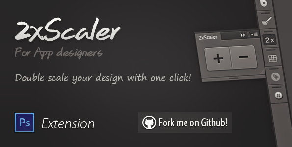
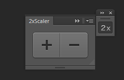
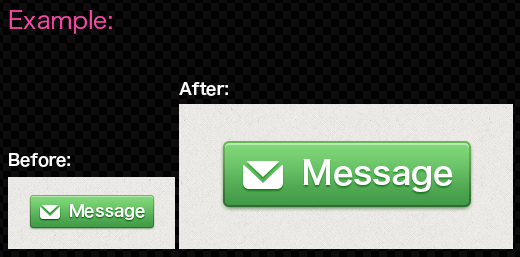
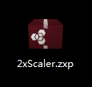

#2xScaler

###A photoshop extension for App designers

### Double scale your design with one click.

version 1.0

---

##Screen shot

##Feature

App designers should understand what's it.

##install

[Download the .ZXP file](2xScaler.zxp) and open it

then Adobe extension manager should show up automatically .

##Usage

After installed, you can find it in the photoshop menu:
####` Window -> Extension -> 2xScaler `

click `+`	or	`-` icon to scale.

##Tips

* Please use the default dark UI
* Please use CS6 because i didn't test it in cs5
* Any feedback or question is welcome: ray@rayps.com

---

Ray

2013/4/19

[www.rayps.com](http://rayps.com/)